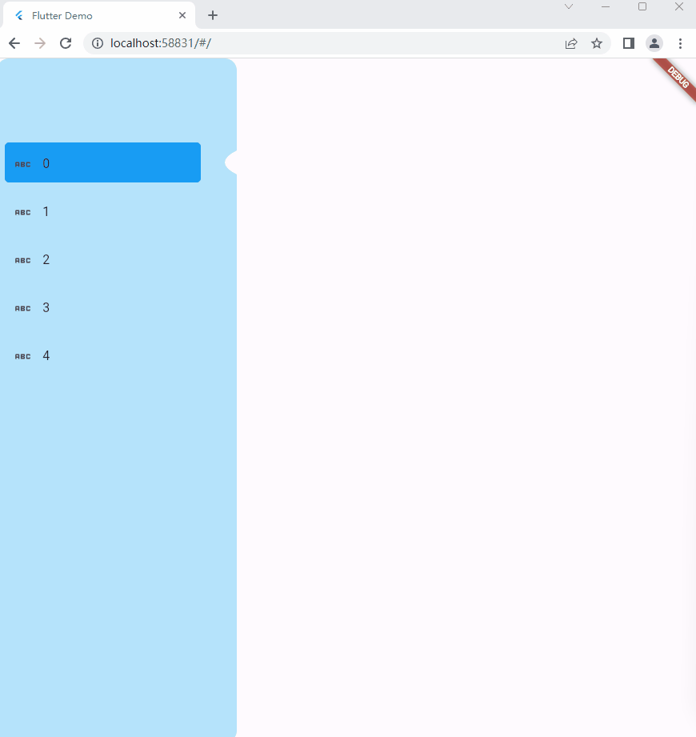
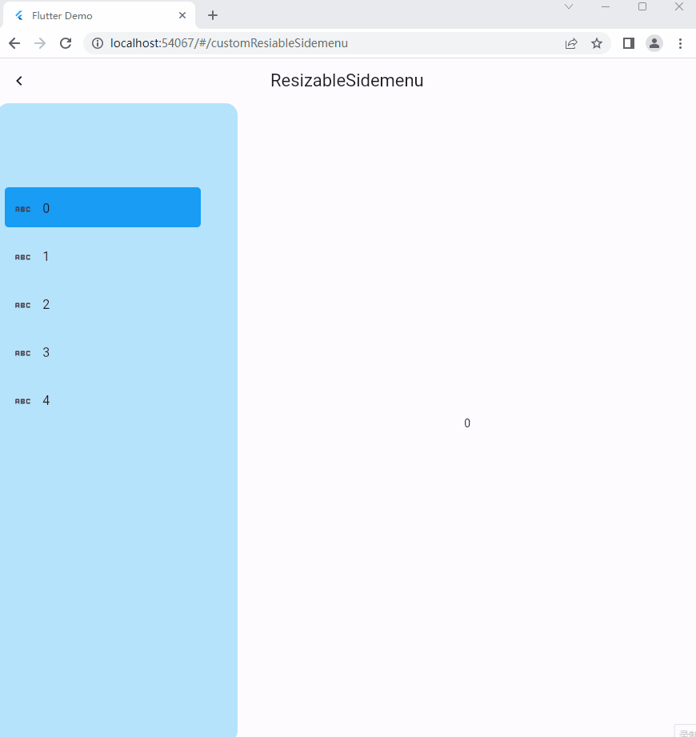
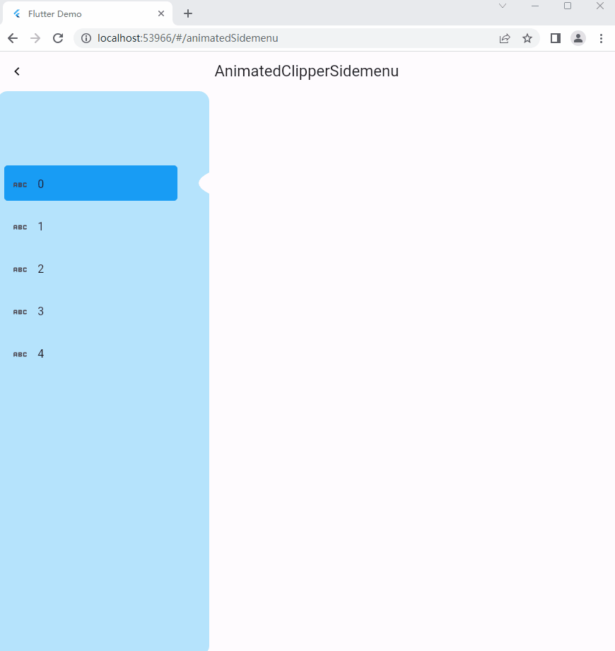
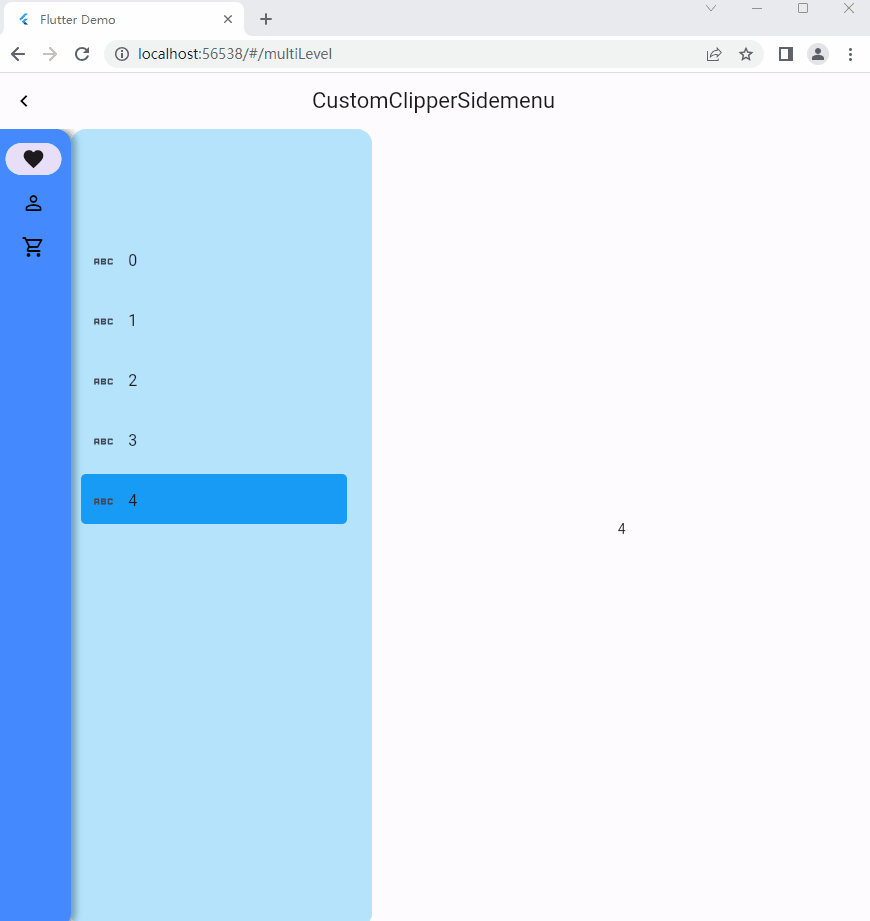

<!--
This README describes the package. If you publish this package to pub.dev,
this README's contents appear on the landing page for your package.

For information about how to write a good package README, see the guide for
[writing package pages](https://dart.dev/guides/libraries/writing-package-pages).

For general information about developing packages, see the Dart guide for
[creating packages](https://dart.dev/guides/libraries/create-library-packages)
and the Flutter guide for
[developing packages and plugins](https://flutter.dev/developing-packages).
-->

Widgets in  [`flutter_admin_template`](https://github.com/guchengxi1994/flutter_admin_template)

## Features

* side menus

  |                                  |                                 |
  | ------------------------------------------------------------ | ----------------------------------------------------------- |
  | [side menu with a custom clipper](example/lib/sidemenus/custom_clipper.dart) | [resizable side menu](example/lib/sidemenus/resizable.dart) |
  |                                  |                                 |
  | [animated side menu](example/lib/sidemenus/animated.dart)    | [multi-level](example/lib/sidemenus/multi_level.dart)       |

* 

## Getting started

```yaml
dependencies:
  fat_widgets:
    git:
      url: https://github.com/guchengxi1994/fat_widgets
```


## Usage

TODO


## Additional information

Enjoy coding.
